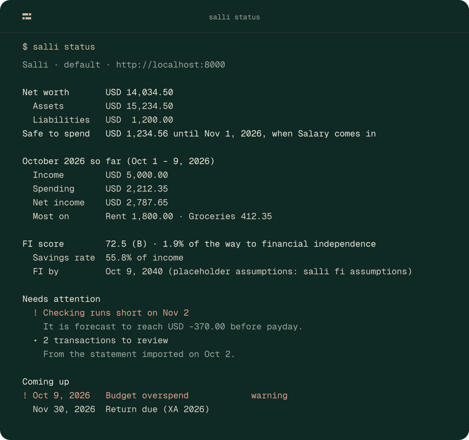
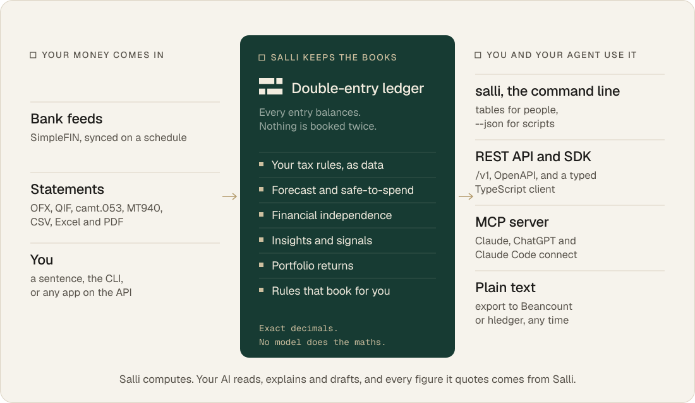

<p align="center">
  
</p>

<p align="center">
  <a href="#quickstart"><b>Quickstart</b></a> ·
  <a href="packages/cli/README.md"><b>The CLI</b></a> ·
  <a href="docs/ai-clients.md"><b>AI clients</b></a> ·
  <a href="docs/taxrules.md"><b>Tax rules</b></a> ·
  <a href="CONTRIBUTING.md"><b>Contributing</b></a> ·
  <a href="docs/brand/README.md"><b>Brand</b></a>
</p>

<p align="center">
  <a href="https://github.com/leafmonkeylabs/salli-core/actions/workflows/ci.yml"></a>
  <a href="https://www.npmjs.com/package/@leafmonkeylabs/salli"></a>
  <a href="LICENSE"></a>
  <a href="packages/sdk/LICENSE"></a>
</p>

**Salli is personal finance with the books kept properly.** A double-entry
ledger sits at the centre. Your banks and statements flow into it. Exact,
deterministic engines work out your tax, your cash flow, your investments and
your path to financial independence, and every figure can be traced to where it
came from.

It runs on your own server, and it works with the AI agent you already use.
**Salli computes; your AI explains.** No model ever does the maths.

Nothing about any country is built in. Your tax rules, planning figures and tax
ids are your data: written by you, or researched by your agent, then cited and
checked before Salli uses them.

<p align="center">
  
</p>

> [!NOTE]
> Salli is young: the API is `v1` and the CLI is `0.1`. Expect rough edges.
> Your whole ledger exports to plain text at any time.

## What Salli does

### Keeps the books

- **A ledger that balances.** Every entry is double-entry and posted entries
  are permanent: a correction is a reversal, never an edit. Amounts are exact
  decimals at your currency's own precision.
- **Your transactions come to you.** Connect banks through SimpleFIN and they
  sync on a schedule, or import a statement in any common format: OFX, QIF,
  camt.053, MT940, CSV, Excel or PDF. Nothing is booked until you review it,
  and nothing is booked twice.
- **Rules that book for you.** Deterministic rules book a payee the same way
  every time, before any model is asked. `salli rules suggest` offers the rules
  your own bookkeeping implies.
- **Your books, in plain text.** `salli export beancount` or `salli export
  hledger` writes your whole ledger out, so you can leave at any time, or use
  Fava alongside.

### Shows what's coming

- **Insights:** cash flow, spending, net worth over time, and the recurring
  payments you may not be tracking.
- **Forecast:** a forecast of your cash to its lowest point, and what's safe
  to spend before payday.
- **Signals:** the things that need your attention: `salli insights`.
- **Real investment tracking.** Transactions and lots, realised and
  unrealised gains, income, and time-weighted and money-weighted returns.
- **Financial independence, in today's money.** Projections run in real terms.
  Until you set your own figures, with their sources, a placeholder stands in,
  and is always labelled as one.

### Works your way

- **Tax rules are yours, as data.** You or your AI agent write your country's
  rules as a versioned, cited rule set, checked against the authority's own
  worked examples. **Only you can activate it.** Salli then:
  - computes your tax with it, and explains every line;
  - prepares your return from the rules' forms;
  - reminds you of the rules' deadlines.

  Each computation records the exact rules behind it
  ([docs/taxrules.md](docs/taxrules.md)).
- **The AI you already pay for.** Connect Claude, Claude Code or ChatGPT over
  MCP, and your subscription does the thinking while Salli supplies the numbers
  ([docs/ai-clients.md](docs/ai-clients.md)). Salli's own AI features run on
  your ChatGPT plan, an OpenAI or Anthropic key, or no key at all.
- **CLI-first.** Everything the API does, `salli` does from the terminal, with
  `--json` for scripts. `salli skills install` teaches your agent to drive it.

> [!IMPORTANT]
> **Not tax advice.** Salli computes tax from your own records, with rules you
> or your agent entered and you activated. It doesn't vouch for the law; the
> rules' sources do.

## How it works

<p align="center">
  
</p>

Salli comes in two parts:
- **The server** is this repository's Python package, run with `salli-server`.
  It holds your data and does the work.
- **The `salli` command line** (Node.js 22, in
  [`packages/cli`](packages/cli/README.md)) is how you use it, from the
  server's machine or any other.

The REST API, the MCP server and any app you build on the
[OpenAPI document](openapi/openapi.json) are clients of the same services.

## Quickstart

For the server you need:
- [Docker](https://docs.docker.com/get-docker/);
- [uv](https://docs.astral.sh/uv/);
- the [Supabase CLI](https://supabase.com/docs/guides/local-development/cli/getting-started).

```bash
git clone https://github.com/leafmonkeylabs/salli-core && cd salli-core
uv sync
supabase start -x studio,storage-api,imgproxy,realtime,edge-runtime,logflare,vector,postgres-meta,mailpit,supavisor,postgrest
uv run salli-server setup
uv run salli-server serve       # http://localhost:8000; API docs at /docs
```

**`supabase start`** runs Postgres and Auth locally. The `-x` list skips the
parts Salli doesn't use.

**`salli-server setup`** writes `.env`, migrates the database, creates your
account and seeds a starter chart of accounts.
- It asks for your email, a password and the currency you keep your money in.
- It also asks, optionally, for an
  [Anthropic API key](https://console.anthropic.com/). Without one, everything
  except the AI features works.

`salli-server doctor` checks the setup at any time, without printing a secret.

Then, in another terminal:

```bash
npm install --global @leafmonkeylabs/salli
salli login                     # http://localhost:8000 by default
salli status
salli add "lunch 12.50 cash"    # the AI drafts the entry, you confirm it
```

## Using it

| You want to… | Run |
|---|---|
| Record a transaction | `salli add "lunch 12.50 cash"`, or exactly: `salli entries add --desc Lunch --debit groceries:12.50 --credit cash:12.50` |
| Import a bank statement | `salli import statement.ofx --account checking` |
| See what's safe to spend | `salli insights safe-to-spend` |
| Your tax position | `salli tax compute`, then `salli tax explain <line>` |
| Budgets, debts, investments, insurance | `salli budgets …`, `salli debts …`, `salli holdings …`, `salli portfolio …`, `salli insurance …` |
| Net worth and reports | `salli reports net-worth`, `salli reports export balance-sheet -o bs.csv` |
| Financial independence | `salli fi score`, `salli fi projections`, `salli fi assumptions` |
| Talk it through | `salli chat`, or `salli ask "…"` |
| Script it | add `--json` to any command: data on stdout, messages on stderr |

Ids can be shortened to any unique prefix. There's more in
[packages/cli/README.md](packages/cli/README.md).

<details>
<summary><b>Your tax rules</b></summary>

Salli knows no country's tax law. Your tax residency (`salli profile set
--tax-residency GB`) decides whose rules compute your tax. The year is the one
your active rules cover today.

1. **Write or import the rules:** `salli tax rules create <file>` or `import
   <file|url>`. Or ask your AI client to run the `research_tax_rules` prompt:
   it drafts from official sources and the authority's worked examples.
2. **Check them:** `salli tax rules validate <set>` until every worked example
   passes.
3. **Activate them yourself:** `salli tax rules activate <set>`. It shows what
   changed, the sources behind each figure and every example's result. It needs
   a person at a terminal: an agent can draft and propose, never activate.

Rule sets export and share as files, but salli-core ships none. See
[docs/taxrules.md](docs/taxrules.md) and
[CONTRIBUTING.md](CONTRIBUTING.md#tax-rules).
</details>

<details>
<summary><b>The API and MCP</b></summary>

- **The REST API** lives under `/v1`. Its OpenAPI document is committed in
  [`openapi/openapi.json`](openapi/openapi.json).
  - Amounts are decimal strings in their currency's own precision, never JSON
    numbers, with the currency alongside.
  - Errors are [RFC 9457](https://www.rfc-editor.org/rfc/rfc9457) problem
    details.
  - `GET /v1/meta` describes the server.
- **Signing in:** clients other than a browser use OAuth 2.1, with PKCE and a
  loopback redirect, or a device code on a machine without a browser.
  - Tokens are issued for the REST API or for MCP, and each accepts only its
    own.
  - For scripts and CI, make a personal access token with `salli tokens
    create`.
- **Your AI client:** to use Salli from Claude, Claude Code or ChatGPT, add
  `https://<your-salli>/mcp` as a connector and approve it on Salli's own
  consent page.
  - Claude's apps connect from Anthropic's cloud, so they need a Salli
    reachable over the internet.
  - Claude Code also works with `http://localhost:8000/mcp`.
  - Step by step: [docs/ai-clients.md](docs/ai-clients.md).
</details>

<details>
<summary><b>Currencies</b></summary>

Your ledger is kept in one **base currency**: any ISO 4217 currency, chosen
when you set up and fixed once you have entries. Amounts are kept at your
currency's own precision: no decimals for yen, three for Kuwaiti dinar.

Accounts can be held in other currencies. Each amount carries the exchange rate
into your base currency. That is the rate your bank used if you give it
(`--fx-rate`), or else the published rate for the entry's date:
- [ECB reference rates](https://www.ecb.europa.eu/stats/policy_and_exchange_rates/euro_reference_exchange_rates/html/index.en.html)
  through [Frankfurter](https://frankfurter.dev);
- [Rates By Exchange Rate API](https://www.exchangerate-api.com) for currencies
  the ECB does not publish.

Every posting records which rate it used. With no rate, Salli asks rather than
guesses.
</details>

## Running the server

`salli-server` is for whoever runs the instance, on its own machine:

| You want to… | Run |
|---|---|
| Set up a new instance | `salli-server setup` |
| Serve the API and MCP | `salli-server serve --host 0.0.0.0 --port 8000` |
| Check it is healthy | `salli-server doctor` |
| Migrate after an upgrade | `salli-server db upgrade` (and `db current`) |
| Let someone else use it | `salli-server members add partner@example.com` |
| Scheduled work for every user (cron) | `salli-server jobs run-advisor`, `jobs sync-banks`, `jobs recompute-tax` |

Each member has their own ledger and signs in with `salli login`. Public
sign-up is off, so only accounts you create can use your instance.

<details>
<summary><b>Configuration</b></summary>

Everything is in `.env` (see [`.env.example`](.env.example)), and `salli-server
setup` fills in the essentials. These are the settings you might change:

| Setting | Default | |
|---|---|---|
| `ANTHROPIC_API_KEY` | none | Your key; every AI feature runs on it |
| `SALLI_REGISTRATION` | `closed` | `open` lets anyone who can sign in create an account |
| `SALLI_STORAGE` | `local` (after setup) | Uploaded files stay in `~/.salli/storage` |
| `MCP_PUBLIC_BASE_URL` | `http://localhost:8000` | This API's URL as MCP clients see it |
</details>

## How it's built

Salli is hexagonal:
- **`domain/`:** a pure core with no I/O. It holds the ledger, the tax rule-set
  engine, FI, budgets, debts, portfolio, insurance, risk and reports.
- **`application/`:** services behind ports.
- **`adapters/`:** adapters for Postgres, AI providers, FX and document
  parsing.
- **`interfaces/`:** thin layers over the same services: the FastAPI app, the
  MCP server and the `salli-server` commands.

The `salli` command line is a client of the API. [`CLAUDE.md`](CLAUDE.md) has
the details.

**Extensions.** A deployment can add to Salli without changing it. An installed
package registered under the `salli.extensions` entry point, and named in
`SALLI_EXTENSIONS`, can contribute:
- a usage meter;
- an entitlement policy;
- API routes;
- `salli-server` commands;
- its own tables and migrations.

Salli itself ships with none: nothing is metered, and every feature is on. See
[`src/salli/extensions.py`](src/salli/extensions.py).

## Contributing

Issues and pull requests are welcome. See [CONTRIBUTING.md](CONTRIBUTING.md).
Contributors accept the [Contributor License Agreement](CLA.md) once, by
commenting on their first pull request. For security issues, see
[SECURITY.md](SECURITY.md). For how Salli looks and sounds, see the
[design direction](docs/brand/README.md).

## License

The server is [GNU Affero General Public License v3.0](LICENSE). If you run a
modified Salli as a network service, you must offer its source to its users.

The TypeScript SDK and CLI in [`packages/sdk`](packages/sdk) and
[`packages/cli`](packages/cli) are [Apache-2.0](packages/sdk/LICENSE), so other
apps and integrations can embed the SDK without taking on the AGPL.

<p align="center"><sub><i>salli</i> is the Sinhala word for money.</sub></p>
