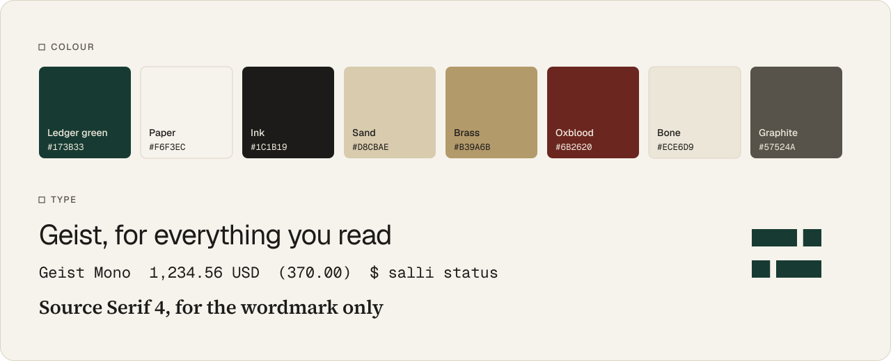
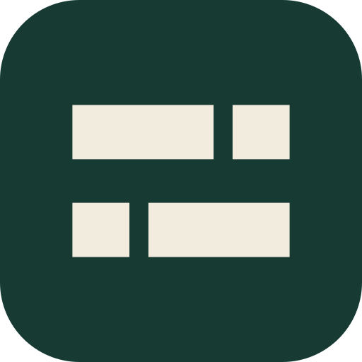

# Salli design direction

**Version 1, October 2026.** This is how Salli looks, reads and sounds from now
on: the README and docs, the website, the web and mobile apps, the command line
and anything an agent writes for Salli. It replaces every earlier Salli style.
Don't take cues from the older apps or site.

<p></p>

## The idea

> **Your money, kept like a firm keeps its books.**

Salli brings an institution's discipline to one person's money:
- a double-entry ledger that always balances;
- figures computed exactly, by engines rather than guesses;
- sources for every number;
- a record of what changed and why.

That discipline comes without the institution: it runs on your server, under your
rules, with the AI you already use.

The design should feel like a well-run private bank's annual report crossed with
a precise instrument: calm, exact, discreet and warm. It should never feel like a
casino, a crypto app or a gamified budget tracker.

**Where the direction comes from.** We took our temperament from Reckoner
Capital's site (reckoner.com):
- warm paper backgrounds;
- a single deep heritage colour;
- sand accents;
- a quiet neo-grotesk set tight at large sizes;
- small square markers before section labels;
- fine engraved line art.

We share that temperament, not its specifics. Salli has its own colour (ledger
green), its own mark and its own motifs.

### The name

*salli* is the Sinhala word for money. Say it like *sully*.

| Write | For |
|---|---|
| **Salli** | the product, in prose |
| **`salli`** | the command |
| **salli-core** | the repository |

Never write SALLI, Salli.ai, Salli App or SalliCLI.

## Personality

| Salli is… | …not |
|---|---|
| **Exact.** We show the figure and where it came from. | Approximate. No "about", no rounded-off precision, no invented statistics. |
| **Calm.** Even a warning is measured and dated: "Checking runs short on Nov 2." | Urgent. No alarms, countdowns or fear of missing out. |
| **Discreet.** Private by default, self-hosted, quiet. | Showy. No confetti, streaks, badges or leaderboards. |
| **Independent.** Your data in plain text, your server, your AI, your country's rules. | Captive. Never lock-in, never "only in our app". |
| **Warm.** Paper tones and plain sentences. | Cold. No jargon walls, no faceless dashboards. |

## Voice

1. **Say the true thing plainly.** Short sentences, in the active voice. Use the
   words a careful person would use.
2. **The number first, then what it means.** "You kept 55.8% of your income this
   month", not "Great savings this month!"
3. **Cite.** A figure that comes from rules or assumptions says so: *as of*,
   *placeholder*, *computed by XA 2026 v1*. Every figure in marketing comes from
   real output. We never make up statistics.
4. **No hype.** We don't use these words:
   - *revolutionary*, *AI-powered*, *smart*, *seamless*, *effortless*;
   - *unlock*, *supercharge*, *magic*, *game-changing*, *wealth hacks*.

   Nor emoji, nor exclamation marks.
5. **Respect the reader.** Assume intelligence. Explain an accounting term once,
   the first time, then use it.
6. **House style:**
   - British spelling: *colour*, *licence* (noun), *organise*.
   - Dates: *Nov 1, 2026* in prose and screens, ISO 8601 in data.
   - Sentence case for headings.

### Tone by context

| Where | Tone | Example |
|---|---|---|
| README, website | Confident, plain, specific | "Salli computes. Your AI explains." |
| CLI output | Terse, aligned, exact | `Safe to spend   USD 1,234.56 until Nov 1, 2026` |
| Errors | What happened, then what to do. No blame, no "Oops". | "No exchange rate for EUR on 2026-10-09. Send the rate your bank used with `--fx-rate`." |
| Warnings | Measured, dated, actionable | "Checking runs short on Nov 2. It is forecast to reach USD -370.00 before payday." |
| AI agents | Careful; quote Salli's figures, never compute | "Salli puts your safe-to-spend at USD 1,234.56 until payday." |

### Rewrites

| Don't | Do |
|---|---|
| 🚀 Supercharge your finances with AI! | Salli computes. Your AI explains. |
| Smart AI categorisation | Rules book each payee the same way every time. The model only suggests. |
| Oops! Something went wrong. | Couldn't reach the bank feed. Salli will try again at 06:00, or run `salli banks sync` now. |
| You're crushing it! 🎉 | You kept 55.8% of your income this month. |
| Effortless tax filing | Your tax, computed line by line from rules you can read, with the sources beside them. |

### Lines we use

- **Your money, kept like a firm keeps its books.** (the primary line)
- Salli computes. Your AI explains.
- Personal finance you can audit.
- Your books, your server, your AI.

## Logo

<p>
  
  &nbsp;&nbsp;&nbsp;
  
</p>

### The balance

The mark is an equals sign made of ledger entries. There are two rows of bars,
each split at a different place, and the two rows total exactly the same length.

- **From a distance** it reads as "=", debits equal credits.
- **Up close** it reads as lines in a ledger.
- **Turned half a turn** it is unchanged: balance, in its geometry.

### Construction

The mark sits on a 24-unit grid:
- bars are 5 units tall, with the rows 4 units apart;
- each split is 1.75 units wide;
- the top row is 13 + 5.25 units, and the bottom row 5.25 + 13.

Never redraw it by eye. Use the files.

### The wordmark and the lockup

- **Wordmark:** *Salli* in Source Serif 4 Semibold, tracked −1%. It is outlined
  in the files; never retype it.
- **Lockup:** the bars are as tall as the wordmark's capitals and stand on its
  baseline. The gap is 0.62 × the cap height.
- **Clear space:** one bar's height (5 units) on every side.
- **Smallest size:** the mark alone at 16 px wide (a favicon). The lockup at
  96 px wide.

### Colourways

| On | Mark | Wordmark | File |
|---|---|---|---|
| Paper | Ledger green | Ink | `salli-logo.svg` |
| Ledger green | Paper | Paper | the README header and social card |
| Night or any dark | Sand | Paper | `salli-logo-on-dark.svg` |
| App icon | Paper on a ledger-green tile | | `salli-icon.svg`, `salli-icon.png` |

### Don't

- Recolour the logo outside the palette, or put it on a gradient or a photo.
- Stretch it, outline it, or add shadows.
- Rearrange or round the bars.
- Retype the wordmark in another face.
- Use any earlier Salli logo.

## Colour

| Token | Hex | Use |
|---|---|---|
| **Paper** | `#F6F3EC` | The page. Salli is warm paper, not white. |
| **Bone** | `#ECE6D9` | Panels, inputs, alternate surfaces |
| **Hairline** | `#DCD4C4` | Rules and borders, 1 px |
| **Ink** | `#1C1B19` | Text and positive figures |
| **Graphite** | `#57524A` | Secondary text |
| **Stone** | `#8A8378` | Large labels and decoration only (3.4:1) |
| **Ledger green** | `#173B33` | The brand colour: headers, primary actions, the mark |
| **Deep green** | `#0F2924` | The terminal, dark panels |
| **Sand** | `#D8CBAE` | Secondary actions, highlights |
| **Brass** | `#B39A6B` | Rules, arrows, engraving. Decoration only (2.4:1 on paper). |
| **Oxblood** | `#6B2620` | Negative figures and debits. Used sparingly. |

**Proportions:** roughly 70% paper, 15% ink, 10% ledger green, 4% sand and
brass, and 1% oxblood.

**Meaning:**
- Green is the brand, not "good". Positive figures are ink.
- Negative figures are oxblood in parentheses.
- Warnings use a clay `!` and words, never flashing red.
- Success is quiet: a ✓ and a sentence.

### On dark

| Token | Hex | |
|---|---|---|
| **Night** | `#0E1513` | The dark page, a green-black |
| **Paper on dark** | `#F2ECDF` | Text |
| **Muted on dark** | `#9AAAA2` | Secondary text |
| **Sand on dark** | `#CDBF9F` | Accents, the mark |
| **Clay** | `#E2A58F` | Negatives and warnings |

### Contrast (WCAG 2.2)

| Pair | Ratio | Passes |
|---|---|---|
| Ink on paper | 15.5:1 | AAA |
| Ledger green on paper | 11.1:1 | AAA |
| Oxblood on paper | 9.9:1 | AAA |
| Graphite on paper | 7.0:1 | AA |
| Paper on ledger green | 10.4:1 | AAA |
| Sand on ledger green | 6.8:1 | AA |
| Paper on night | 15.7:1 | AAA |
| Muted on night | 7.6:1 | AAA |
| Clay on night | 8.8:1 | AAA |

## Typography

| Face | Licence | Use |
|---|---|---|
| **Geist** | OFL | Everything you read: headings, body, UI, tables (with tabular figures) |
| **Geist Mono** | OFL | The terminal, code, ids, and plain-text exports shown on screen |
| **Source Serif 4** Semibold | OFL | The wordmark only |

### Scale

Sizes in px, then line height, then tracking:

| Role | Size | Line height | Tracking |
|---|---|---|---|
| Display | 64 | 1.0 | −3% |
| Heading 1 | 44 | 1.1 | −2.5% |
| Heading 2 | 30 | 1.2 | −2% |
| Heading 3 | 22 | 1.3 | −1% |
| Body | 16 | 1.55 | 0 |
| Small | 14 | 1.5 | 0 |
| Label (Geist 500, capitals) | 12–13 | 1.4 | +12% |
| Mono | 14 | 1.5 | 0 |

### Rules

- Tighten as type grows, and never track body text.
- Use sentence case. Capitals are for small labels only, each after a small
  outlined square (as in the README).
- Emphasise with weight 500, not italics.
- Keep lines under about 68 characters.

## Numbers

Numbers are Salli's product.

- **Amounts:**
  - with their currency code, as the CLI shows them: `USD 1,234.56`;
  - in tables, the code goes in the column header and the figures stand alone;
  - right-aligned, in tabular figures, with the decimals aligned.
- **Precision:** exactly the currency's own. No decimals for yen, three for
  Kuwaiti dinar. Never round for display unless it says so.
- **Negatives:**
  - in tables and statements, `(370.00)` in parentheses, in oxblood;
  - in prose and the CLI, a minus sign: `USD -370.00`.
- **Totals:** a hairline above and a double rule below, the accountant's double
  underline. It echoes the mark's two rows.
- **Provenance:** a figure that came from rules or assumptions carries it:
  - *as of Oct 9, 2026*;
  - *placeholder assumptions*;
  - *computed by XA 2026, version 1*.
- **Formats:** percentages to one decimal (`55.8%`); dates as `Nov 1, 2026`.
- **No count-up animations.** A number is exact from the first frame. A
  count-up shows values that were never true.

## Layout and components

This section is for the web and mobile apps to come.

- **Grid:** 12 columns with 24 px gutters, content up to 1200 px wide. Leave
  generous space: 96–128 px between sections on the website, 32–48 px in the
  app.
- **Surfaces:**
  - paper, with bone panels;
  - cards with a 1 px hairline border and a 10–14 px radius;
  - no drop shadows, except one faint shadow for overlays.
- **Section labels:** a small outlined square, then a tracked capital label.
- **Buttons:** 40 px tall, 8 px radius, no gradients.
  - Primary: ledger green fill, paper text.
  - Secondary: sand fill, ink text.
  - Tertiary: text, underlined on hover.
- **Tables:**
  - hairline row rules, no zebra stripes;
  - a sticky header in the label style;
  - figures right-aligned.
- **Charts:**
  - 1.5 px lines in ledger green, comparisons in brass or sand;
  - shortfalls in oxblood at 12% opacity;
  - hairline gridlines;
  - label the figures on the chart.
  - No 3D. No pie chart with more than five slices.
- **Forms:** labels above the inputs; inputs on bone with a hairline border; a
  2 px brass focus ring.
- **Icons:** a 24 px grid, 1.5 px strokes, square caps and joins, geometric.
  Filled squares for bullets.
- **Motion:** fades and short slides of 120–200 ms, easing out. No bounces, no
  confetti.

## Motifs and imagery

- **Ledger ruling:**
  - what: hairline horizontal rules at 4–6% opacity on ledger green, like
    ledger paper;
  - where: the README header and social card.
- **The guilloché rosette:**
  - what: the engraving on banknotes. Rotated copies of a wavy circle, whose
    crossings weave bands. It fits a name that means money;
  - where: hero moments only. Sand at about 30% opacity on ledger green, never
    behind body text.
- **The balance:** the mark's bars can repeat as a pattern, sparingly.
- **Photography:** none in the product. If the website ever needs it, use real
  people at home in natural light, warm and slightly desaturated.
- **Never:**
  - stock photos of couples with laptops;
  - coins, piggy banks or 3D renders;
  - charts that only go up;
  - crypto imagery.

## The command line

The CLI is a brand surface too:
- plain, aligned and exact;
- colour only to guide the eye: muted labels, a clay `!` for warnings;
- `NO_COLOR` is always respected;
- the output contract (`--json`, exit codes) matters more than decoration.

## Assets

Everything is in [`assets/`](assets) and generated by [`build/`](build). Every
word in them is outlined, so they look the same wherever they appear.

| File | Use |
|---|---|
| `salli-logo.svg` | The logo on light backgrounds |
| `salli-logo-on-dark.svg` | The logo on dark backgrounds |
| `salli-mark.svg`, `salli-mark-on-dark.svg` | The mark alone |
| `salli-icon.svg`, `salli-icon.png` | App icon and avatar (512 px) |
| `readme-header.svg` | The README's header; works in light and dark mode |
| `how-it-works.svg` | The README's overview diagram |
| `terminal-status.svg` | `salli status`, from the CLI's own snapshot test |
| `social-preview.svg`, `social-preview.png` | The repository's social card (1280 × 640) |
| `brand-specimen.svg` | The colour and type sheet at the top of this page |

### Regenerating them

The fonts come from npm's fontsource packages; HarfBuzz shapes the text and
fontTools outlines it. Run:

```bash
mkdir -p /tmp/salli-brand && cd /tmp/salli-brand
npm install @resvg/resvg-js@2.6.2 @fontsource/geist@5 @fontsource/geist-mono@5 @fontsource/source-serif-4@5
uvx --with fonttools --with brotli --with uharfbuzz python -I \
  -c "import sys; sys.path.insert(0, '<repo>/docs/brand/build'); sys.argv=['build_assets.py', '/tmp/salli-brand/node_modules/@fontsource', '<repo>/docs/brand/assets']; exec(open('<repo>/docs/brand/build/build_assets.py').read())"
node <repo>/docs/brand/build/render.mjs /tmp/salli-brand <repo>/docs/brand/assets/social-preview.svg <repo>/docs/brand/assets/social-preview.png 1280
```

Change the tokens in `build_assets.py` and in this document together.

## For agents writing for Salli

Before you publish words or screens for Salli, check:

1. **Voice:** plain, exact, calm. None of the banned words, no emoji, no
   exclamation marks.
2. **Figures:** every figure is real (from Salli or its tests) and says where it
   came from. Never compute money yourself.
3. **Colours and type:** only the colours above, and Geist (with Geist Mono for
   code and figures in the terminal). The wordmark is always the outlined file.
4. **Negatives:** in parentheses and oxblood in tables; a minus in prose and the
   CLI.
5. **Restraint:** nothing celebratory, urgent or decorative that doesn't carry
   meaning.
